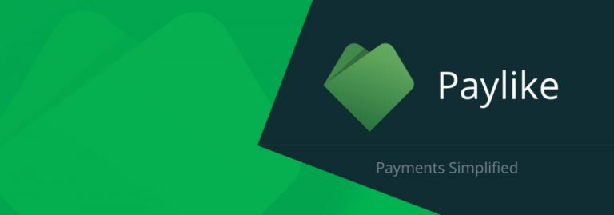

import BrowserWindow from "@site/src/components/BrowserWindow";

A Paylike WooCommerce integrációja 5-10 percet vesz igénybe. Komolyan! Ők megelőlegezik a bizalmat és elhiszik, hogy azok vagyunk, akiknek mondjuk magunkat. Természetesen itt is azonosítani kell magad és ameddig nem teszed meg, nem utalják tovább neked a bankkártyás fizetéseket.

<!--truncate-->

Az azonosítás abból áll, hogy megadod a bankszámláaszámodat (magyart is elfogad természetesen) és a személyes adataidat. Fel kell tölteni az igazolványaid másolatát és 1-2 napon belül aktiválják a fiókodat. Amíg nem aktív a fiók, addig is tud üzemelni és használhatod a szolgáltatást.

## Paylike integrációja WooCommerce-el

https://www.youtube.com/watch?v=1Js6eT518U8

## Költségei

(A bejegyzés írásakor volt ennyi, természetesen változhat)

A jutalékuk 1,1% + 75 Ft. Ez is jónak néz ki.

Átlátható költségek, regisztrációs és havidíj nélkül. Leegyszerűsített díjszabás, hogy minél érthetőbb legyen mindenki számára.

- Ingyenes regisztráció
- Havidíj nélküli használat
- Ingyenes visszatérítés (csak a 75 forint terhelési díjat veszíti el)
- Ingyenes ügyfélszolgálat
- Azonnali valutaváltás (az Ön kifizetési pénznemére)
- Ingyenes elszámolás bármely EU-s bankszámlára

Paylike fiókkal lehetőséged az összes Visa, Mastercard és Maestro kártyátípus elfogádására (Visa Electron, Visa-Dankort, céges bankkártya, betéti kártya, hitelkártya, stb.). A Mastercard SecureCode és Verified by Visa szolgáltatások beépített, ingyenes funkcióként érhetőek el.

## A Paylike előnyei:

**Pluginek**
Integrálj anélkül, hogy akár egy sor kódot is írtál. Fedezze fel bővítményeinket és emelje vállalkozását a következő szintre kevesebb, mint 10 perc alatt!

**3-D Secure**
A fizetési ablakunkhoz 3-D Secure szolgáltatást biztosítunk. A 3-D Secure szolgáltatás MasterCard-al és Visa-val is használható. A 3-D Secure engedélyezésével kártya tranzakcióit biztonságosabbá teheti.

**Egyéni fizetési űrlap**
Tervezze meg 100%-ban fizetési ablakát. Megoldást kínálunk rá, hogy létrehozzon egyedi fizetési űrlapot, anélkül, hogy kártya adatok tárolásával kellene foglalkoznia szerverén.

**Azonnali kezdés**
Regisztráljon e-mail címével és azonnal fogadhat fizetéseket. Nincs várakozási idő. A háttérben végezzük ellenőrzéseinket, hogy jóváhagyhassuk tranzakcióit.

**Dinamikus leíró**
Tranzakciónként személyre szabhatja az ügyfelei bankszámlakivonatán megjelenő szöveget. Például megrendelési azonosító hozzáadásával, ezzel szolgáltatva referenciát és jobb ügyfélszolgálatot vásárlóinak.

**Ismétlődő fizetések/ előfizetések**
Könnyedén végezhet ismétlődő tranzakciókat API-on vagy az egyik bővítményünkön keresztül. A kártya adatok tárolása és az ismétlődő átutalások nem járnak extra költségekkel.

**Testreszabhatóság**
Hozzon létre egyéni leírást és akár saját fizetési űrlapot. A funkció nem jár extra költségekkel és örömmel segítünk a folyamat bármely pontján.

**Gyönyörű fizetési ablak**
A gyönyörű és reszponzív felugró fizetési ablakkal azonnal fogadhat átutalásokat. A teljes mértékben a konverziós rátára optimalizált szolgáltatásunkkal jelentős előnyre tehet szert versenytársaival szemben.

**Számlázzon ügyfeleinek bármilyen pénznemben**
Ügyfelei a saját pénznemükben fizethetnek, ezzel javítva konverzióit. Szinte bármilyen létező pénzemet támogatunk. A valutaváltás a háttérben történik az Ön által választott kifizetési pénznemre.

**Kártya tokenizálás**
Kártya tokenizálást is támogatunk, hogy Ön biztonságosan tárolhasson kártya adatokat későbbi használatra, például előfizetések esetén. A tokenizálás használata, a valós kártya adatok tárolásával szemben, növeli a biztonságot és csökkenti PCI foglaltságát.

**Fizetési linkek**
Hozzon létre fizetési linket, hogy fogadhasson kifizetéseket ügyfeleitől, például e-mailen vagy számlán keresztül. Készítse el a linket közvetlenül a műszerfalon fizetési link űrlapunk használatával.

**Virtuális POS**
Létrehoztunk egy bárhol alkalmazható, gyönyörű virtuális POS-t. Használhatja tableten való vásárlásoknál, bútor áruházában vagy akár jégkrémet árulva a tengerparton.

**13 kifizetési pénznem**
Kifizetéseit 13 különböző pénznemben választhatja: EUR, USD, GBP, DKK, NOK, SEK, CHF, HUF, PLN, RON, CZK, BGN és HRK. Vásárlóitól bármely Visa és Mastercard által támogatott valutában fogadhat tranzakciókat.

**Heti elszámolás**
Elszámolásait minden héten fogadhatja. Az Ön által kiválasztott EU-n belüli bankszámlára szerdánként utaljuk kifizetéseit. Más elszámolási feltételek is alkalmazhatók a vállalkozásától függően.

**Teljes sandbox környezet**
Ingyenes és teljes sandbox környezet, 1: 1-es paritással. Próbáljon ki minden funkciót egy ingyenes próbaszámlával és integrációja működésbe lép, amint valós tranzakciókra vált.

**Többnyelvű ügyfélszolgálat**
A felugró fizetési ablak több, mint 10 európai nyelven érhető el és a lista folyamatosan bővül. Elengedhetetlen, hogy fizetéskor ügyfelei megtalálják a szükséges információkat saját anyanyelvükön. Magyarul is elérhető.

https://paylike.hu/
